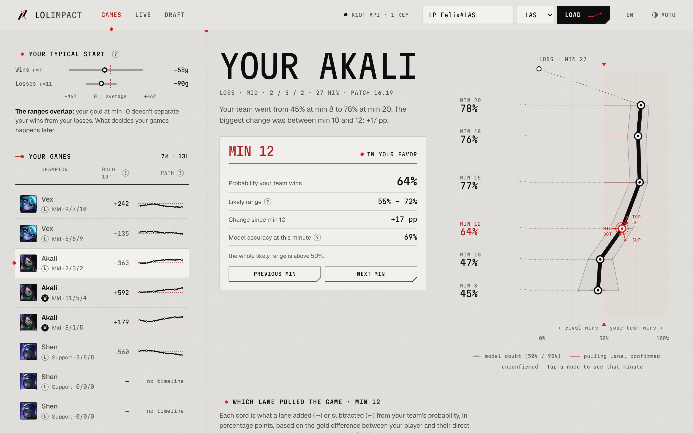
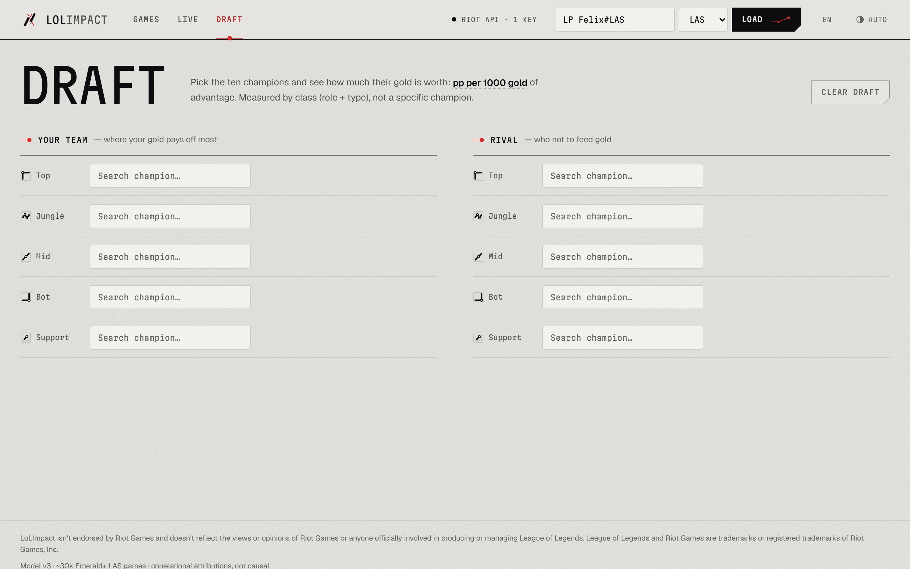
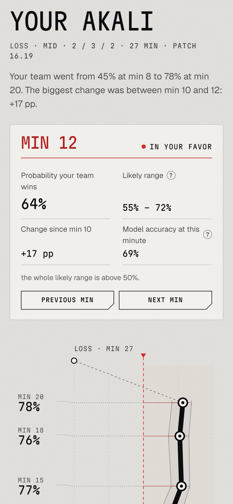
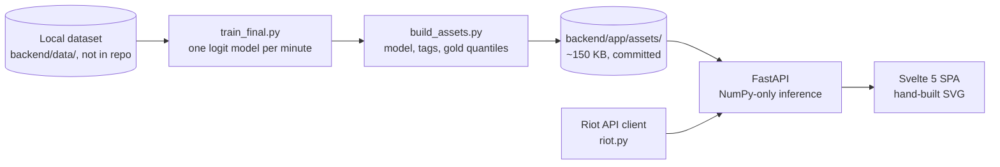

# LoLImpact

**Minute-by-minute win probability for League of Legends ranked games, with every estimate shown next to its uncertainty.**

[Live site](https://lol-impact.vercel.app) · [Case study](https://anderssonfelix.com/work/lolimpact/) · [Author: Felix Andersson](https://anderssonfelix.com)

     

> The public deploy currently runs without a Riot API key, so the Games and Live views only render from a local run. Draft works on the live site. The screenshots below come from a local run with cached data.

<picture>
  <source media="(prefers-color-scheme: dark)" srcset="docs/screenshots/lol-main-dark.webp">
  
</picture>

## What it is

LoLImpact loads a player's recent ranked solo queue games and shows how their team's win probability moved at minutes 8, 10, 12, 15, 18 and 20, which lane pulled it, and where each player's gold stood against others in the same role. A Live view rates the champions in a game in progress, and a Draft view rates ten picks by how much their gold converts into win probability.

The difference from typical stat sites is that no number ships without its interval. Effects whose 95% interval covers zero are drawn as slack grey members and labeled unconfirmed, and champion claims stay at class level (role plus Data Dragon tag), because at this data volume a single champion's effect cannot be separated from team gold. Attributions are correlational, not causal.

<table>
  <tr>
    <td width="66%" valign="top">
      <picture>
        <source media="(prefers-color-scheme: dark)" srcset="docs/screenshots/lol-draft-dark.webp">
        
      </picture>
      <br><sub><b>Draft.</b> Pick ten champions; each gets a value in pp of win probability per 1,000 gold of advantage, measured by class, with its interval.</sub>
    </td>
    <td width="34%" valign="top" align="center">
      <picture>
        <source media="(prefers-color-scheme: dark)" srcset="docs/screenshots/lol-mobile-dark.webp">
        
      </picture>
      <br><sub><b>Mobile.</b> The same match view at phone width.</sub>
    </td>
  </tr>
</table>

## Model quality

Held-out test set, Emerald+ LAS solo queue, patches 16.16 to 16.19. Values are read from [`backend/app/assets/model_v3_full.json`](backend/app/assets/model_v3_full.json).

| Minute | Training games | Test games | Accuracy | Log loss |
|---:|---:|---:|---:|---:|
| 8 | 6,065 | 1,258 | 62.8% | 0.630 |
| 10 | 6,045 | 1,254 | 65.9% | 0.610 |
| 12 | 6,030 | 1,251 | 69.1% | 0.592 |
| 15 | 6,008 | 1,247 | 71.9% | 0.551 |
| 18 | 5,796 | 1,203 | 73.2% | 0.526 |
| 20 | 5,693 | 1,181 | 74.9% | 0.507 |

A coin flip scores 50% accuracy and 0.693 log loss. Fewer games reach minutes 18 and 20, so those models train on less data.

## How it's built



**Features** ([`backend/app/features.py`](backend/app/features.py)). For every player at each landmark minute, gold and CS advantage are measured against the mean of all ten players in the game. The design matrix is team-level: blue minus red, summed by role (gold in thousands, CS in units of 50), plus class adjustments for each Data Dragon tag (Tank, Fighter, Mage, Assassin, Marksman, Support) and one dummy per patch.

**Per-minute logistic models** ([`backend/app/train_final.py`](backend/app/train_final.py)). One scikit-learn `LogisticRegression` per landmark, trained on the last four patches in the data. Games are ordered by match ID; the last 15% is the test set and the 15% before it is validation. The L2 strength `C` is picked from `{0.03, 0.1, 0.3, 1, 3}` by validation log loss. The export holds the intercept, every coefficient, the Laplace covariance `(XᵀWX + I/C)⁻¹` and a SHA-256 prefix of the feature file it was trained on.

**Role and class slopes, not champion slopes.** A champion's gold slope is its role slope plus the adjustments for its tags. An earlier version fit one slope per champion. The per-champion gold columns add up to the team gold difference by construction, so no amount of data can split that total per champion; diagnostics during development (run in the data pipeline, which is not part of this repo) confirmed those slopes were not identifiable. In the shipped model, standard errors on the gold slopes are 0.6 to 2.2 pp per 1,000 gold. The Marksman adjustment is the largest positive class effect and its interval excludes zero at every minute; most other class effects are shown as unconfirmed.

**Intervals with no ML runtime** ([`backend/app/analysis.py`](backend/app/analysis.py)). Serving loads the model JSON and computes everything with NumPy. The win-probability band is the delta method on the logit scale: `sigmoid(logit ± 1.96·√(xᵀΣx))`. A lane's contribution is its slope times its gold difference times 25 (the logistic slope at 50%, in pp), with its own standard error; it is marked identified only when `|pp| > 1.96·SE`. The Draft and Live endpoints in [`backend/app/main.py`](backend/app/main.py) sum role and tag slopes per champion and approximate the SE by summing their variances. Production dependencies are FastAPI, Pydantic and NumPy ([`backend/pyproject.toml`](backend/pyproject.toml)); pandas and scikit-learn are only needed to train.

**Precomputed quantiles** ([`backend/app/build_assets.py`](backend/app/build_assets.py)). The "vs. your role" percentiles come from 201 quantiles (every 0.5 percentile) of gold advantage per role and minute, about 41,000 to 44,000 players per cell. At request time a percentile is a single `np.interp` call instead of loading the feature CSV with pandas.

**Rate-limited Riot client** ([`backend/app/riot.py`](backend/app/riot.py)). Thread-safe, with sliding windows per key (20 requests per second, 100 per two minutes) and round-robin across several keys. A 429 waits for `Retry-After`, 5xx and network errors back off exponentially (capped at 20 s), a 401 retires the key, and 400/403/404 return nothing instead of retrying. PUUIDs are encrypted per key, so each one stays pinned to the key that issued it. JSON is written atomically (temp file, then `os.replace`). Matches and timelines are fetched cache-first, and when no key is alive the profile endpoint falls back to a local player index ([`backend/app/build_index.py`](backend/app/build_index.py)) and the last cached profile, and reports that it is degraded.

**Hand-built SVG column** ([`frontend/src/components/Column.svelte`](frontend/src/components/Column.svelte)). No chart library. Time runs up the page and each minute is a node offset from a dashed 50% axis. The 95% envelope comes from the API and the 50% interval is rebuilt from it in logit space ([`frontend/src/lib/format.ts`](frontend/src/lib/format.ts)). Lane cords from the selected node use the same pp scale as the axis: confirmed cords are straight lines, unconfirmed ones are quadratic curves that sag. Nodes spring off the axis in sequence with a back-out ease, skipped under `prefers-reduced-motion`, and arrow keys move between minutes. The match-list sparklines ([`MiniColumn.svelte`](frontend/src/components/MiniColumn.svelte)) are the same drawing at small size.

**Personal pattern.** With six or more matches, the profile compares gold at minute 10 in wins versus losses, with 90% bootstrap intervals (1,000 resamples), so a small sample shows up as a wide range.

## Stack

- **Backend:** Python 3.12+, FastAPI, NumPy. Training: pandas, scikit-learn.
- **Frontend:** Svelte 5, TypeScript, Vite. Geist and Martian Mono via Fontsource. No chart or component library. English and Spanish UI, light and dark themes.
- **Data:** Riot Games API (account-v1, match-v5, spectator-v5), Data Dragon for champion data and icons.
- **Hosting:** Vercel Services (static frontend plus a Python function).

API: `GET /api/health`, `GET /api/profile?riot_id=Name%23TAG&region=LAS`, `GET /api/match/{region}/{matchId}`, `POST /api/draft`, `GET /api/live?riot_id=Name%23TAG&region=LAS`.

## Running locally

The model assets are committed, so the app runs without the training dataset. Loading real profiles needs a Riot API key.

```bash
# backend (http://localhost:8000)
cd backend
python -m venv .venv
source .venv/bin/activate        # Windows: .venv\Scripts\activate
pip install -r requirements.txt
export RIOT_API_KEY=...          # or put the key in backend/data/.key
python -m uvicorn app.main:app --port 8000

# frontend, in a second terminal (http://localhost:5173, proxies /api to :8000)
cd frontend
npm install
npm run dev
```

Alternatively, `npm run build` in `frontend/` writes `frontend/dist/`, which FastAPI serves at http://localhost:8000. Load a profile by Riot ID (for example `LP Felix#LAS`); profiles are shareable with `?rid=Name%23TAG&region=LAS`.

**Environment**

| Variable | Purpose |
|---|---|
| `RIOT_API_KEY` | One or more Riot API keys, comma-separated. Without it, the backend reads `backend/data/.key` (one `RGAPI-` key per line). Development keys expire every 24 hours. |
| `LOLIMPACT_CACHE_DIR` | Optional. Where fetched matches, timelines and profiles are cached. Defaults to `backend/data/cache`, or `/tmp/lolimpact-cache` on Vercel. |
| `VERCEL` | Set by Vercel; switches the cache to `/tmp`. |

**Retraining** needs the local dataset in `backend/data/` (gitignored, not published): `python -m app.train_final` fits the models, `python -m app.build_assets` refreshes `backend/app/assets/`, and `python -m app.build_index` rebuilds the offline player index. All three run from `backend/`.

## Deploy

[`vercel.json`](vercel.json) defines two [Vercel Services](https://vercel.com/docs/services): `frontend/` builds with Vite, and `backend/` runs `app.main:app` as a Python function (max duration 300 s) that excludes `data/**` and `requirements.txt`, so production installs only the `pyproject.toml` dependencies. Rewrites send `/api/*` to the backend and everything else to the frontend. Import the repo in Vercel and set `RIOT_API_KEY`. The match cache lives in `/tmp` per instance, so the first profile load on a cold instance is slower.

## Limitations

- Attributions are correlational, not causal. Gold advantage predicts winning; this is not an experiment.
- Scope is LAS, Emerald+, patches 16.16 to 16.19. Other regions can be selected but are scored with the LAS model, and games on later patches get no patch term.
- Accuracy is about 63% at minute 8 and 75% at minute 20. Early-minute estimates are close to a coin flip, and the intervals say so.
- Champion effects are class-level (role plus tags) and labeled as such. Most class effects are shown as unconfirmed because their intervals cover zero.
- Intervals are Laplace approximations conditional on the chosen `C`; the intercept's uncertainty is not included.
- Live assumes one early kill is about a 600-gold swing in the lane (+300 killer, −300 victim), ignoring plates and XP, and infers roles from champion tags.
- Matches without a timeline show no curve.

## License

[MIT](LICENSE)

## Credits

Built with an AI-assisted workflow in which statistical claims were cross-checked between two LLMs (GLM and Claude); three headline results were retracted when their intervals did not hold. Data via the Riot Games API; champion assets via Data Dragon.

*LoLImpact is not affiliated with or endorsed by Riot Games.*
