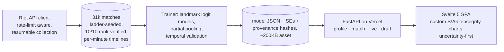

# LoLImpact

**League of Legends win-probability analytics with honest uncertainty — an end-to-end ML pipeline, from raw Riot API data to a deployed product, that shows what the data can support and admits what it can't.**

     

Most LoL stats tools show precise-looking numbers. LoLImpact was built around the opposite bet: **every estimate ships with its uncertainty, and the interface has a visual grammar for "the model doesn't know"**. That's not modesty — it's the result of the project's most interesting finding (below), and it's what makes the numbers it does show trustworthy.

---

## What's in the box

| Layer | What it is |
|---|---|
| **Data pipeline** | ~48k soloQ matches collected through a rate-limit-aware Riot API client (resumable checkpoints, atomic writes). Model dataset: 31k matches **seeded from the ranked ladder and verified player-by-player** (all 10 players Emerald+ via `league-exp`), with per-minute timelines. |
| **Models** | One logistic model per game-minute landmark (8/10/12/15/18/20): win probability from gold/CS differentials, with slopes by **role and champion class** (partial pooling instead of one-hot-per-champion), temporal splits, and Laplace standard errors for every coefficient. |
| **Backend** | FastAPI serving the models as pure-JSON inference (no ML runtime in production), profile/match/live/draft endpoints, degraded-cache mode when API keys expire. Deployed to Vercel with the 36GB dataset distilled into three asset files. |
| **Frontend** | Svelte 5 + TypeScript SPA with **hand-built SVG charts** (no chart library): matches drawn as a *tensegrity column* where each minute's node hangs off the 50% axis, confirmed effects render as taut cables and unconfirmed ones as slack gray members. Light/dark, responsive, accessible tooltips. |

Predictive quality (held-out test, Emerald+ LAS): **63% accuracy at minute 8 → 77% at minute 20** (log loss 0.63 → 0.49 vs 0.693 base).

## The interesting part: we caught our own model being non-identifiable

The first model parameterized one slope per champion (172 columns). Three independent diagnostics — rankings that reordered between runs, estimates that moved 5× with regularization, and a flat Hessian — pointed at the same thing. A float64 SVD of the design matrix settled it: **15 exactly-zero singular values**. Team gold is, by algebraic construction, the sum of the per-champion columns, so no amount of data can ever split it per champion. The standard error told the story numerically:

| Parametrization | SE of a champion's slope |
|---|---|
| Per-champion dummies | **35,355 pp** (pure prior — zero data information) |
| Role × champion-class (current) | **1.2 – 3.4 pp** |

Four orders of magnitude from reparametrization alone, not from more data. The pipeline now runs this identifiability audit as a first-class check, the UI renders only class-level champion claims (with per-element "identified / interval covers zero" states), and the [honest limitations](#honest-limitations) below are part of the product.

## Architecture



## Product features

- **Match history** with per-match win-probability sparklines (from your perspective, win/loss colored).
- **Match deep-dive**: win-prob curve with credibility bands, per-lane impact over time (each point marked identified/unconfirmed), per-player table with role percentiles from the reference dataset.
- **Live game detection** (`spectator-v5`): evaluates the ongoing game's 10 champions and translates early kills into win probability under an explicit assumption (1 kill ≈ 600g lane swing).
- **Draft evaluator**: which classes convert gold fastest — the higher the card, the more dangerous to feed.
- **Personal patterns** with bootstrap intervals on your own history (small n → wide, honest intervals).

## Engineering notes worth a code review

- `backend/app/riot.py` — thread-safe Riot client: rate limiting, retry/backoff with proper 429/403/404 semantics, and cache-first fetching so the app degrades gracefully when the API is unreachable.
- `backend/app/train_final.py` — trains in well-conditioned units (k-gold), picks regularization on a temporal validation split, and exports the full covariance matrix so the API propagates uncertainty bands per request (delta method in `analysis.py`).
- `backend/app/build_index.py` — scans the local match cache into a 135k-player index, powering a no-API degraded mode.
- Resumable collection: every stage checkpoints; a kill mid-run loses nothing (atomic `tmp+rename` writes).

## Honest limitations

- Champion-individual effects are **non-identifiable by construction** at this data volume — every champion-level claim in the UI is at class level (role + tags), labeled as such.
- Attributions are correlational, not causal (gold advantage predicts winning; this isn't an experiment).
- Scope: LAS server, Emerald+, recent patches. Slopes are retrained per patch window.
- Class effects are only "confirmed" where their interval excludes zero (e.g., Marksmen convert early gold fastest); everything else renders explicitly as unconfirmed.

## Quickstart

**Deployed (Vercel)** — import the repo on vercel.com (framework and commands come from `vercel.json`), set the `RIOT_API_KEY` env var (production key), done. Production does not need the 36GB dataset: the model ships as assets (`python -m app.build_assets` after retraining, then commit). The match cache lives in `/tmp` per instance, so the first profile load on a cold instance is slower.

**Local**
```bash
# backend
cd backend
pip install -r requirements.txt
python -m uvicorn app.main:app --port 8000   # retrain: python -m app.train_final

# frontend (once, and after UI changes)
cd frontend && npm install && npm run build   # dist/ is served by FastAPI
# or: npm run dev  → hot reload on :5173, proxies /api to :8000
```
Open http://localhost:8000 and load a profile (e.g. `LP Felix#LAS`; shareable via `?rid=Name%23TAG&region=LAS`). Local mode uses the full dataset — your Riot API key goes in `backend/data/.key` (production key recommended; dev keys expire every 24h).

## Credits

Built through an **adversarial AI-assisted workflow**: every statistical claim had to survive cross-examination between two LLMs (GLM + Claude) — including three retractions of headline results when their intervals didn't hold. Data via the Riot Games API; champion assets via Data Dragon.

*Not affiliated with or endorsed by Riot Games.*
